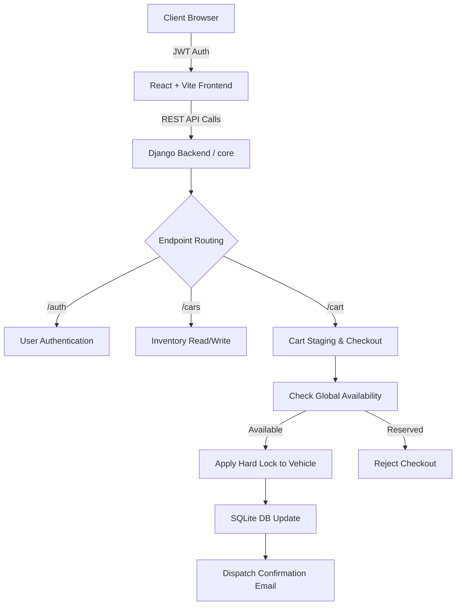
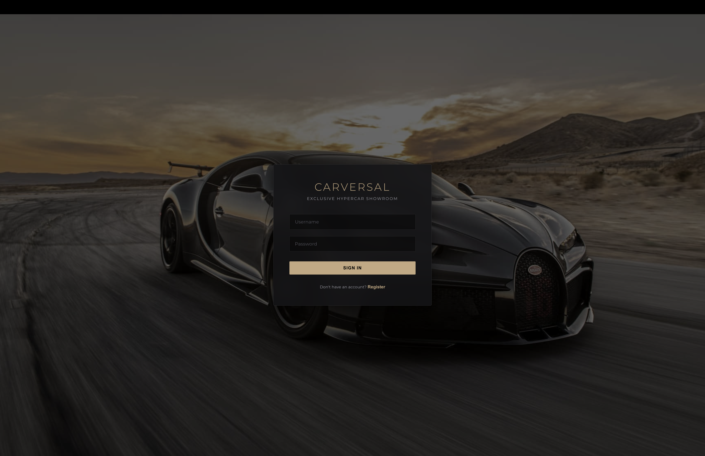
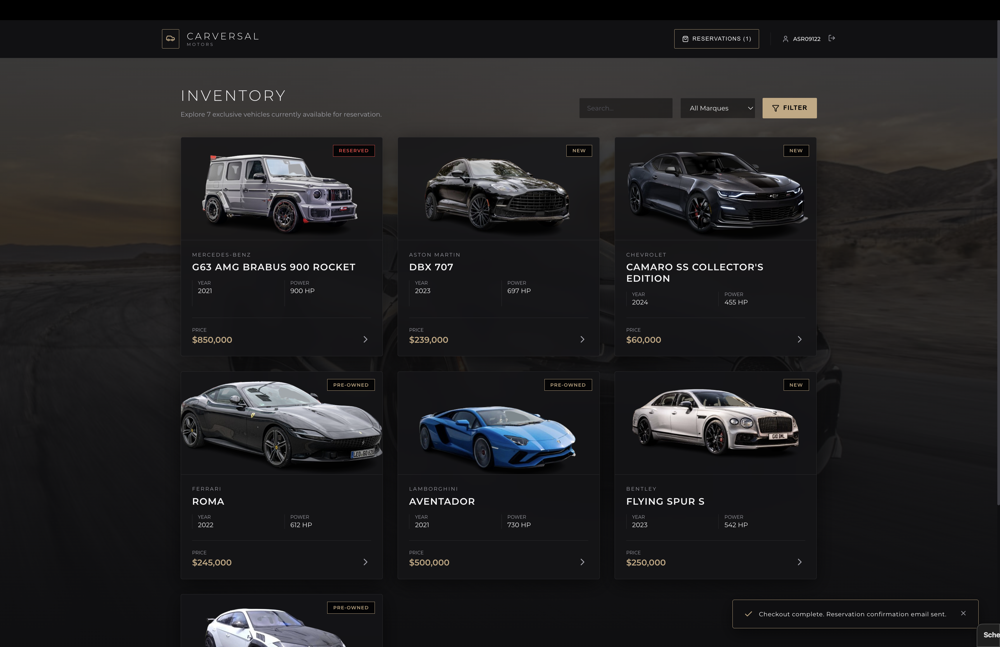
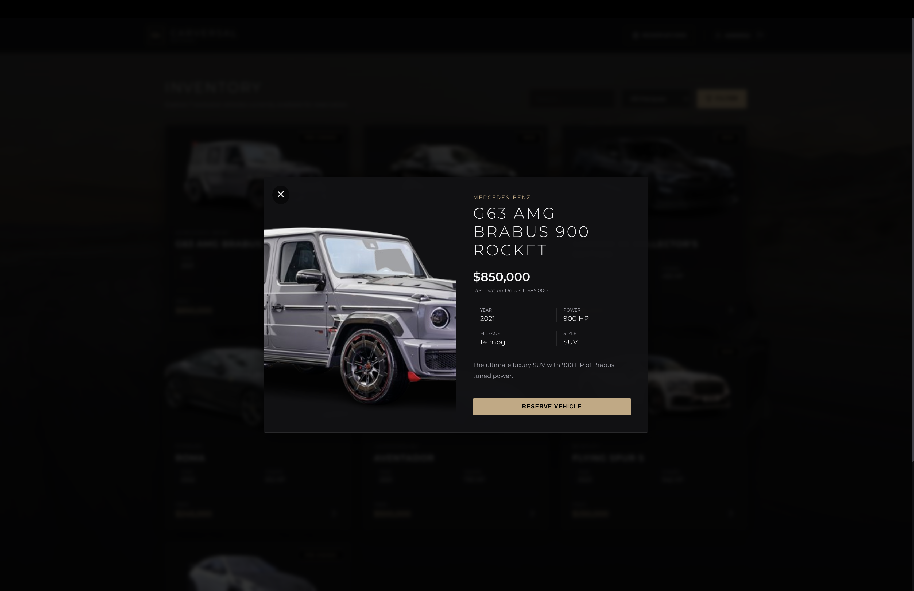
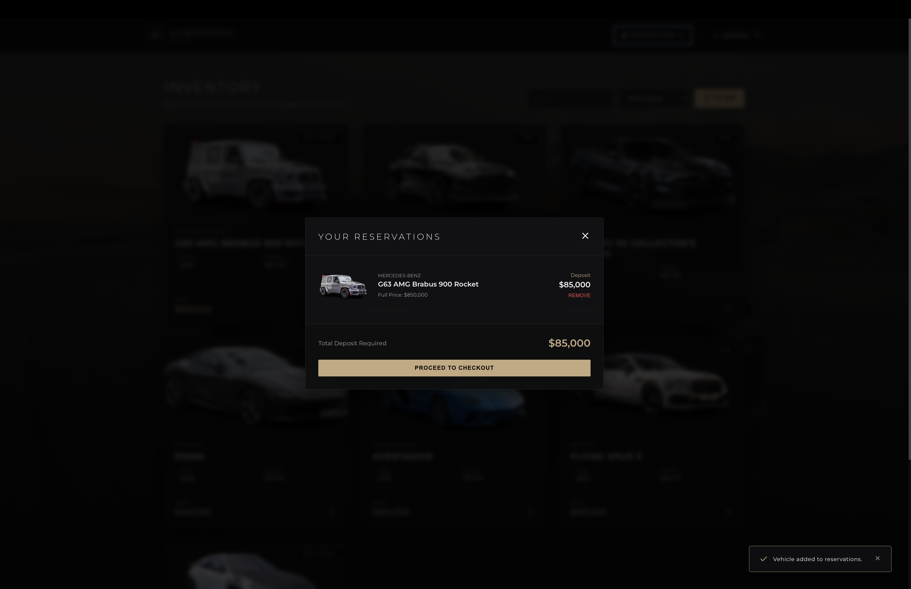

<div align="center">

# 🏎️ Carversal Hyper Motors

### Exclusive B2C Hypercar Dealership & Reservation Platform

*A premium, full-stack application that provides a sophisticated storefront for hypercar reservations, automated email dispatching, and secure cart staging.*

<br>

<p align="center">


</p>

</div>

---

## 📑 Table of Contents

- [Overview](#-overview)
- [Problem Statement](#-problem-statement)
- [Key Features](#-key-features)
- [System Architecture](#-system-architecture)
- [Screenshots](#-screenshots)
- [API Endpoints](#-api-endpoints)
- [Tech Stack](#-tech-stack)
- [Installation](#-installation)
- [Test Credentials](#-test-credentials)
- [Project Structure](#-project-structure)
- [Future Improvements](#-future-improvements)
- [Contributing](#-contributing)
- [Acknowledgements](#-acknowledgements)
- [Author](#-author)
- [Support](#-support)

---

## 📖 Overview

Carversal Hyper Motors is an **end-to-end full-stack e-commerce platform** tailored for ultra-luxury automotive dealerships. It handles the complete customer journey, automatically managing:

1. **Secure Access** to an exclusive, members-only vehicle inventory.
2. **Soft-Hold Staging** via a dynamic reservation cart system.
3. **Strict 10% Deposit Calculations** applied dynamically based on real-time vehicle prices.
4. **Hard-Lock Checkout** to prevent double-booking of one-of-a-kind hypercars.
5. **Automated Email Dispatching** for confirmation and cancellation receipts.

Built with a **React + Vite** frontend and a **Django REST Framework** backend, using robust **JWT** authentication.

---

## 🎯 Problem Statement

Traditional automotive platforms often suffer from:

- Generic, non-premium user interfaces that fail to match the luxury product.
- Lack of complex staging logic (allowing multiple users to race for the same limited inventory).
- Missing automated reservation calculations (deposits).

Existing e-commerce templates are too rigid. **Carversal** solves this by providing a highly customized, glassmorphism-heavy frontend paired with a modular, logic-driven Django backend.

---

## ✨ Key Features

### 🔒 Secure Authentication
- JWT-based authentication flow.
- Login via Email or Username.

### 🛒 Soft-Hold Staging & Hard-Lock Checkout
- Vehicles can be added to a cart without globally locking them out.
- Upon checkout, the system verifies availability and applies a hard lock, blocking other users.

### 💰 Dynamic 10% Deposit Engine
- Instantly calculates a precise 10% reservation deposit based on the vehicle's full price tag.

### ✉️ Automated Email Notifications
- Connects to the logged-in user's profile to dispatch beautiful, dynamic reservation and cancellation emails (currently configured to terminal output for development).

### 🎨 Premium UI/UX
- Animations powered by Framer Motion.
- Dark-themed, glassmorphism aesthetics.

---

## 🏗️ System Architecture



---

## 📸 Screenshots

### 🔑 1. Secure Access Portal


### 🏎️ 2. Exclusive Inventory


### 📖 3. Vehicle Specifications


### 💳 4. Staging & Secure Checkout


---

## 🌐 API Endpoints

| Method | Endpoint | Description | Auth Required |
|--------|----------|-------------|:---:|
| `POST` | `/api/core/auth/signup/` | Register a new client account | No |
| `POST` | `/api/core/auth/login/` | Authenticate via email/username & get JWT Token | No |
| `GET`  | `/api/core/cars/` | Fetch all vehicles (supports search & filters) | No |
| `GET`  | `/api/core/cars/<id>/` | Fetch specific hypercar details | No |
| `POST` | `/api/core/cars/add/` | Add a new vehicle to the inventory | Yes |
| `GET`  | `/api/core/cart/` | View staged reservations & total deposit | Yes |
| `POST` | `/api/core/cart/` | Soft hold a vehicle (Add to staging cart) | Yes |
| `DELETE`| `/api/core/cart/<id>/` | Remove a vehicle from the cart / unreserve | Yes |
| `POST` | `/api/core/cart/checkout/` | Hard lock reservations & trigger email confirmation | Yes |

---

## 🚀 Tech Stack

| Category | Technologies |
|----------|--------------|
| Language | Python 3.12, JavaScript |
| Backend | Django, Django REST Framework |
| Frontend | React.js, Vite |
| Styling & Animations | Tailwind-inspired CSS, Framer Motion |
| Database | SQLite (Development) |
| Authentication | JSON Web Tokens (JWT) |

---

## ⚙️ Installation

```bash
# 1. Clone the repo
git clone <repository_url>
cd carshowroom

# 2. Backend Setup: Create a virtual environment
python3 -m venv venv
source venv/bin/activate  # On Windows: venv\Scripts\activate

# 3. Install backend dependencies
cd car
pip install -r requirements.txt

# 4. Apply Database Migrations
python manage.py makemigrations
python manage.py migrate

# 5. Start the Django Server
python manage.py runserver
# (Leave this terminal running)

# 6. Frontend Setup: Open a new terminal
cd car/frontend
npm install

# 7. Start the Vite Server
npm run dev
```

**Backend API:** `http://localhost:8000/`  
**Frontend UI:** `http://localhost:5173/`  

---

## 🔐 Test Credentials

| Username | Email | Password | Role |
|----------|-------|----------|------|
| admin | admin@carversal.com | admin123 | Superuser |

*(You can also register a new user directly from the frontend UI).*

---

## 📂 Project Structure

```text
carshowroom/
├─ assets/                    # Documentation screenshots
├─ car/                       # Django Backend
│   ├─ Car/                   # Project settings & main routing
│   ├─ carversal/             # Inventory models and database schemas
│   ├─ core/                  # API endpoints, JWT, Cart logic, Emails
│   ├─ frontend/              # React + Vite Application
│   │   ├─ src/               # React components, styles, and logic
│   │   └─ package.json       # Node dependencies
│   ├─ manage.py              # Django CLI script
│   └─ requirements.txt       # Python dependencies
├─ venv/                      # Virtual Environment
└─ README.md                  # This file
```

---

## 📈 Future Improvements

- 💳 **Stripe Integration**: Process the 10% deposit directly via credit card rather than simulated checkout.
- 📱 **Mobile App**: A React Native companion app for high-net-worth clients to manage reservations on the go.
- ☁️ **Cloud Deployment**: Containerize with Docker and deploy to AWS/GCP with a production PostgreSQL database.
- 📊 **Admin Dashboard**: A frontend panel for dealership managers to add/remove inventory visually.

---

## 🤝 Contributing

Contributions are welcome! Please follow these steps:

1. Fork the repository.
2. Create a feature branch (`git checkout -b feature/awesome-feature`).
3. Commit your changes with a clear message.
4. Push to your fork and open a Pull Request.

---

## 🙏 Acknowledgements

- React and Vite for an incredibly fast and modern frontend experience.
- Django & DRF for rock-solid backend architecture.
- Framer Motion for providing the premium, buttery-smooth animations.

---

## 👨‍💻 Author

### Abhayjot Singh

Full-Stack Developer – building premium, production-ready web applications using modern Javascript frameworks and Python backends.

---

## ⭐ Support

If you found this repository useful, please give it a ⭐ on GitHub. Your support motivates further development and helps other developers discover the project.

---

## ❤️ Thank you for visiting!

Made with ❤️ using React, Vite, Django, and Python.
